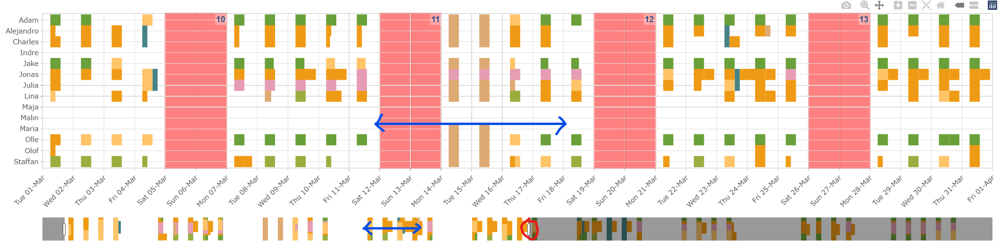

**PlUpp** är ett internt webb-app som hjälper att planera projekt, fördela resurser samt följa projekts budget. Det kopplar QBIS med vår egen planering system i Canopy. Om du är inte där än, du når det här [Plupp](https://greensway.shinyapps.io/Plupp/).

```{=html}
<div style="padding:0.1cm 0.1cm 0.1cm 0.1cm;background:#6AA039">
<h3>Inloggning</h3>
</div>
```
{width="800"}

Du loggar in med dina "Canopy" inloggningsuppgifter (samma som du använder i NVB-appen). Om du har inte fått en Canopy konto än, mejla gärna [support\@greensway.se](mailto:support@greensway.se?subject=Jag%20behöver%20en%20Canopy%20konto)

Innan du börjar, här kommer några typs som kan hjälpa utforska verktyget.


Menyn kommer ta dig där du behöver. Du kan byta månad fram och tillbacka med pilarna på sidan datum, eller välja från kalender om di klickar på datum. Se nedan för en detalj av varje sektion.


"Hover" gärna över figurer, då kommer du se olika möjligheter. Först kommer det dyka upp ett meny där du kan välja att zooma in, spara bilden, m.m. Kanske viktigare, det kommer att dyka upp ett s.k. tooltip med extra detaljer om delen av figuren du är på.

```{=html}
<div style="padding:0.1cm 0.1cm 0.1cm 0.1cm;background:#6AA039">
<h3>Månadsvis budget</h3>
</div>
```
Detta sektion visar hur det går i stor sätt för hela månaden när man räknar ut allt planerad och inarbetad tid.

{width="800"}

Den första stapeln "Planerad hela månad" visar hur mycket är inplanerad, men detta tar inte hänsyn för planerad timmar som blev inte inarbetad eller fixad retroaktiv. Den andra stapeln "Planerad kvarstående månad + inarbetad" gör precis det, från den dagen man tittar och framåt räknar planerad timmar, och bakåt räknar inarbetad timmar från QBis. Det beror så klart på att alla registrerar timmar i sina tidskort. Den tredje stapeln visar då bara det inarbetad tid. På sidan ser man hur stor andel av det som kvarstår som planerad i timmar (respektiv stapeln i mitten) är (rapporterad som) inarbetad.

Efter figuren ser man en detaljerad tabell av alla projekt som bearbetas den månad. Det viktigast där är att jämföra projektviss planering mot inarbetad. Man kan välja att vissa ven dessa projekt som är aktiv under månaden men har inte någon timme inplanerad samt inaktiva (avslutad/arkiverad) projekt. Med "+" knappen öppnas fler kolumner.


```{=html}
<div style="padding:0.1cm 0.1cm 0.1cm 0.1cm;background:#6AA039">
<h3>Plannering</h3>
</div>
```
Här kommer du hamna oftast. Här kan du se vilka projekt är planerad för dig och dina kollegor i varje vecka. OBS! även att man kan se planering daggvis betyder det inte att daggar är planerad (förutom lediga daggar). Detta är framför allt för att fördela timmar. Du kan även se figuren grupperad per projekt, eller timmar sammanfattad veckovis om du väljer "Matris" istället för "Tidslinje".

{width="800"}

{width="800"}

{width="800"}

Varje gång du ser en dubbel pil som muspekare (t.ex. där blå pillar finns) det betyder att du kan dra åt sidan. Du kan också använda den vita "handtag" markerad i röd för att zooma in i tid.

{width="800"}

Efter figurerna kommer en detaljerad lista av planerad aktiviteter.

{width="800"}

```{=html}
<div style="padding:0.1cm 0.1cm 0.1cm 0.1cm;background:#6AA039">
<h3>Projekt portfölj</h3>
</div>
```
Är du projekt ledare då kanske vill du kicka på projekt portfölj och se till att allt information stämmer samt att du kör inte över budget.

{width="800"}

```{=html}
<div style="padding:0.1cm 0.1cm 0.1cm 0.1cm;background:#6AA039">
<h3>Årets budget</h3>
</div>
```
För att stämma av planerad, inarbetad och bokfört hinner i kap med det som är budgeterad har vi då den här sammanfattning av årets ekonomi.

{width="800"}

```{=html}
<div style="padding:0.1cm 0.1cm 0.1cm 0.1cm;background:#6AA039">
<h3>Qbis connect</h3>
</div>
```
Här hittar du datumet där sista uppdatering med QBis har hänt. Detta borde uppdateras varje arbetsdag.
